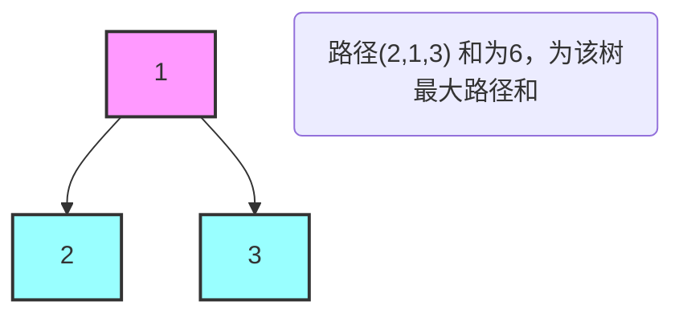
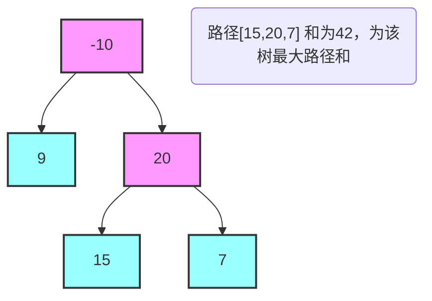
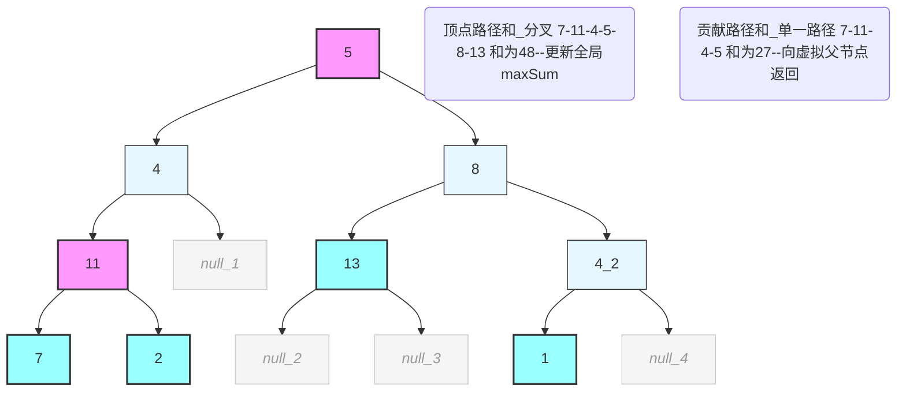

在LeetCode二叉树相关题目练习中，路径类问题因其定义灵活、遍历方向不确定等特点，往往成为解题难点。本文将针对经典难题——LeetCode 124. 二叉树中的最大路径和，从题目解读、解题思路、代码实现到常见误区，逐步拆解核心逻辑，结合mermaid图解辅助理解，帮助读者厘清解题思路，规避常见错误。

## 一、题目解读：读懂“路径”的关键定义

明确题目中“路径”的核心定义是解题的前提，多数解题错误源于对路径规则的误解，具体规则如下：

- 路径为节点序列，相邻节点之间必须存在边连接，不可跳跃节点；

- 同一节点在单条路径中至多出现一次，避免形成循环路径；

- 路径至少包含一个节点，极端情况下，当二叉树仅含一个节点时，该节点即为路径本身；

- 路径不一定经过根节点，子树中的路径和可能大于经过根节点的路径和，这是解题的关键要点。

题目要求：给定二叉树的根节点root，返回所有可能路径中节点值总和的最大值（路径和定义为路径中所有节点值的累加和）。

### 通过示例进一步理解题意

示例1：二叉树为 [1,2,3]（根节点为1，左子节点为2，右子节点为3）


该二叉树的所有可能路径及对应路径和如下：[2]（和为2）、[3]（和为3）、[1]（和为1）、[2,1,3]（和为6）、[1,2]（和为3）、[1,3]（和为4），其中最大路径和为6。

示例2：二叉树为 [-10,9,20,null,null,15,7]（根节点为-10，左子节点为9，右子节点为20；20的左子节点为15，右子节点为7）


该二叉树中，路径[15,20,7]的路径和为42，是所有可能路径中的最大值，其路径和大于经过根节点的路径和。

## 二、解题思路：DFS的适用性分析

二叉树路径类问题通常可采用深度优先搜索（DFS）求解，其核心原因在于DFS能够天然遍历每个节点的左右子树，便于计算以当前节点为核心的路径和，适配路径“向下延伸”或“跨节点延伸”的特点。

本题的核心难点在于：路径可呈现“分叉”形态（如示例1中的路径2→1→3，以节点1为中心，分别向左右子树延伸），但递归向上层节点回溯时，路径不可分叉——上层节点的路径仅能从左、右子树中选择一条继续延伸。

### 核心思路拆解（核心要点）

解题的关键在于区分两个核心概念，二者极易混淆，需重点厘清，结合mermaid图解辅助理解（图表如下）：

图解1：两类路径和的区别（以复杂二叉树 [5,4,8,11,null,13,4,7,2,null,null,null,1] 为例）


结合上述复杂二叉树（含3层节点、均为正数，贴合常规测试场景），解题核心思路可条理化梳理如下，全程对应图解1的节点与路径逻辑：

1. **明确核心前提**：解题关键是区分两类路径和（二者是DFS执行的核心，极易混淆）：
                  顶点路径和：以当前节点为中心，可同时向左右两个子树延伸（如图解1中路径7→11→4→5→8→13），属于完整路径，核心作用是更新全局最大路径和；

2. 贡献路径和：仅能向左右子树中的一条延伸（不可跨层分叉），核心作用是向父节点传递有效路径和，供父节点计算自身路径和使用（如图解1中贡献路径7→11→4→5）。

3. **DFS执行逻辑（分步推进）**：基于上述两类路径和，DFS递归遍历的流程固定为3步：
   1. 步骤1：计算子树贡献值——递归遍历当前节点的左、右子树，分别获取其向当前节点的贡献值；若贡献值为负数，取0舍弃（避免降低整体路径和）；

   1. 步骤2：更新全局最大路径和——计算当前节点的顶点路径和（左贡献值+右贡献值+当前节点值），与全局maxSum对比，取较大值更新；

   2. 步骤3：返回父节点贡献值——向父节点返回当前节点的贡献路径和（左、右子树贡献值的最大值+当前节点值），确保父节点仅能选择单一路径延伸。

4. **补充注意点**：全局最大路径和（maxSum）需初始化为负无穷（-Infinity），而非0。原因是二叉树可能存在所有节点值均为负数的极端场景，此时最大路径和应为单个节点的最大值，若初始化为0会导致结果错误，后续将结合相关图解进一步说明。

## 三、代码详解：逐行拆解与逻辑分析

题目已给出TreeNode的定义及函数框架，以下先给出完整可运行的TypeScript代码，再逐行解析核心逻辑（JavaScript版本可删除类型注解直接使用），结合前文mermaid图解对应代码关键步骤。

### 完整可运行代码

```typescript
// 二叉树节点定义（题目已给出，无需修改）
class TreeNode {
  val: number
  left: TreeNode | null
  right: TreeNode | null
  constructor(val?: number, left?: TreeNode | null, right?: TreeNode | null) {
    this.val = (val === undefined ? 0 : val)
    this.left = (left === undefined ? null : left)
    this.right = (right === undefined ? null : right)
  }
}

// 核心解题函数
function maxPathSum(root: TreeNode | null): number {
  // 边界条件：空树返回0（题目规定路径至少包含一个节点，该条件仅作为兜底）
  if (!root) return 0;
  // 初始化最大路径和为负无穷，兼容全负数二叉树场景（对应图解3）
  let maxSum = -Infinity;
  
  // DFS递归函数：返回当前节点向父节点贡献的最大路径和（对应图解1、2）
  const dfs = (node: TreeNode | null): number => {
    // 递归终止条件：空节点无路径和贡献，返回0
    if (!node) return 0;
    
    // 计算左子树贡献值，负数取0（舍弃左子树）
    const left = Math.max(0, dfs(node.left));
    // 计算右子树贡献值，负数取0（舍弃右子树）
    const right = Math.max(0, dfs(node.right));
    
    // 核心步骤：更新全局最大路径和（当前节点为顶点的完整路径和，对应图解1、2）
    maxSum = Math.max(maxSum, left + right + node.val);
    
    // 向父节点返回单一路径延伸的最大贡献值（对应图解1、2）
    return Math.max(left, right) + node.val;
  }

  // 从根节点启动DFS遍历（对应图解2的递归流程起点）
  dfs(root);
  // 返回全局最大路径和
  return maxSum;
};
```

### 逐行解析核心代码（重点为dfs函数）

1. `if (!root) return 0;`：设置兜底边界条件，空树返回0。根据题目要求，路径至少包含一个节点，因此当输入root不为null时，该条件不会执行；若输入root为null（题目未明确禁止），则返回0作为兜底结果。

    `let maxSum = -Infinity;`：定义全局变量maxSum，用于存储所有路径中的最大路径和。初始化为负无穷，目的是适配二叉树所有节点值为负数的极端场景（对应图解3的复杂全负二叉树），例如复杂全负树中最大路径和为-1，若初始化为0，会导致结果错误。

    `const dfs = (node: TreeNode | null): number => { ... }`：定义DFS递归函数，其核心功能是返回当前节点向父节点贡献的最大路径和（对应图解1、2的复杂二叉树贡献路径和），同时在递归过程中更新全局最大路径和。

2. `if (!node) return 0;`：递归终止条件，空节点无法产生任何路径和贡献，因此返回0。

    `const left = Math.max(0, dfs(node.left));`：递归计算左子树向当前节点的贡献值。采用Math.max(0, ...)的逻辑，是为了舍弃负贡献——若左子树贡献值为负数，纳入路径会降低整体和，此时取0等价于不选择左子树延伸（对应图解2中复杂二叉树节点H的左贡献处理，左子树为空、贡献0）。

3. `const right = Math.max(0, dfs(node.right));`：与左子树逻辑一致，递归计算右子树的贡献值，负数取0以舍弃负贡献。

    `maxSum = Math.max(maxSum, left + right + node.val);`：核心步骤。计算以当前节点为顶点的完整路径和（左子树贡献值+右子树贡献值+当前节点值，对应图解1、2的复杂二叉树顶点路径和），并与全局maxSum比较，更新全局最大路径和。该步骤是唯一允许路径分叉的场景，因当前节点作为路径顶点，可同时向左右子树延伸。

    `return Math.max(left, right) + node.val;`：向父节点返回当前节点的最大贡献值（对应图解1、2的复杂二叉树贡献路径和）。由于父节点路径仅能从左、右子树中选择一条延伸方向，因此取左、右子树贡献值的最大值，加上当前节点值，作为向上层节点的贡献。

    `dfs(root);`：从根节点启动DFS递归遍历，触发整个路径和计算流程（对应图解2的复杂二叉树递归起点）。

4. `return maxSum;`：递归遍历结束后，全局maxSum即为所有可能路径中的最大路径和，返回该值作为最终结果。

## 四、常见踩坑点：三大误区及规避方法

本题整体通过率较低，主要原因是解题过程中易陷入以下三大误区，结合前文mermaid图解辅助规避：

**误区1：将maxSum初始化为0**。该误区忽略了二叉树所有节点值为负数的场景（对应图解3的复杂全负二叉树），此时最大路径和应为单个节点的最大值（如复杂全负树中的-1），而非0。正确做法是将maxSum初始化为负无穷（-Infinity）。

**误区2：递归返回值错误设置为left + right + node.val**。该错误混淆了“以当前节点为顶点的完整路径和”与“向父节点的贡献路径和”（对应图解1的复杂二叉树），返回分叉路径会导致父节点路径和计算错误，最终影响整体结果。

**误区3：未处理子树负贡献场景**。若子树贡献值为负数，未做舍弃处理直接纳入路径计算，会降低整体路径和，可能导致错过正确的最大路径和（对应图解3的复杂全负二叉树，子树贡献多为负数，需取0舍弃）。

## 五、总结：解题核心与拓展思考

### 解题核心

本题的核心逻辑是“DFS遍历 + 区分两类路径和（顶点路径和、贡献路径和）”，核心原则可概括为：向下递归计算子树贡献值，向上回溯更新全局最大路径和。递归过程中需舍弃子树负贡献，回溯时仅向父节点返回单一路径延伸的贡献值，确保路径逻辑的合理性（所有核心逻辑均对应前文复杂二叉树的mermaid图解，可对照回顾）。

### 拓展思考

本题作为二叉树路径和问题的经典题型，掌握其解题逻辑后，可快速应对同类变形题目，例如：

- 二叉树中最大的根到叶子路径和（路径固定从根节点出发，至叶子节点结束）；

- 二叉树中任意两个节点之间的最大路径和（核心逻辑与本题一致，仅路径覆盖范围更广）。

最后提示：求解二叉树递归类题目时，需先明确递归终止条件与递归返回值的含义，再开展代码编写工作。若对逻辑理解不清晰，可通过手动模拟复杂二叉树的DFS执行流程（如前文mermaid图解所示），直观掌握每一步的计算逻辑，更易应对多层级、多节点的复杂场景。